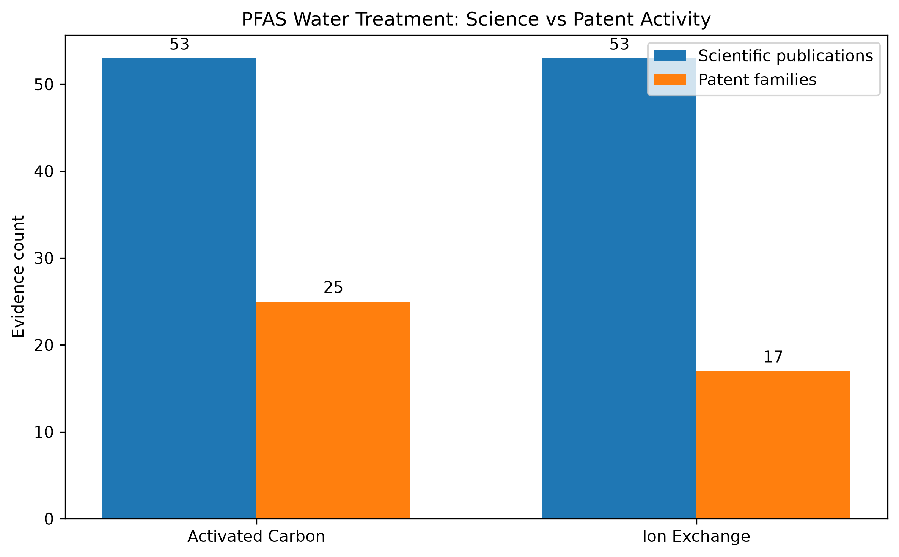

# PFAS Water Technology Landscape

## Executive Summary

This technology landscape evaluates emerging and established approaches for the removal and destruction of per- and polyfluoroalkyl substances (PFAS) in water.

The analysis integrates scientific literature, patent activity, institutional collaboration, technology-maturity signals and selected deployment evidence. The objective is not to identify a single universally superior treatment technology, but to determine which approaches show the strongest combination of scientific activity, technological development and movement toward practical application.

The scientific corpus contains 658 publications published between 2018 and 2026. Activity increased strongly during the study period, with total annual records rising from 14 in 2018 to 140 in 2023.

Adsorption is the dominant scientific technology category, with 167 classified publications. Other major areas include photocatalysis, electrochemical oxidation, ion exchange, membranes, plasma, hydrothermal treatment and supercritical water oxidation.

Several destructive technologies show particularly strong recent momentum. Electrochemical oxidation increased from 7 publications in 2018–2020 to 37 in 2023–2025. Hydrothermal treatment increased from 3 to 23 over the same periods, while supercritical water oxidation emerged as a distinct research area after 2020.

Scientific maturity evidence shows that PFAS treatment is progressing beyond laboratory proof of concept. Manually validated records include:

- full-scale granular activated-carbon treatment in drinking water;
- pilot-scale activated-carbon and ion-exchange treatment;
- pilot and field demonstrations of electrochemical oxidation;
- field demonstration of supercritical water oxidation;
- pilot-scale plasma treatment.

The patent landscape reveals different innovation profiles across technologies.

Activated carbon has the broadest patent portfolio in the current analysis, with 25 included patent families. Although capture-only approaches remain dominant, the portfolio also includes combined processes, regeneration, mobile systems, in-situ treatment and capture-and-destroy concepts.

Ion exchange contains 17 included patent families. Its portfolio is more concentrated but shows clear innovation around selective and functionalized resins, regeneration and capture-and-destroy architectures.

Electrochemical oxidation retains 15 patent families in the pilot analysis and shows particularly strong recent activity, with many families having priority dates from 2024 onward.

Institutional analysis highlights several coherent technology-development programmes. Battelle shows one of the clearest applied trajectories in supercritical water oxidation, progressing from aqueous treatment studies to field demonstrations and site-specific deployment. The University of Georgia shows strong activity in electrochemical oxidation and integrated capture-and-destroy systems. The University of Surrey and Arcadis demonstrate sustained collaboration in sonolysis, while Rice University shows a coherent development path in photocatalytic and integrated capture–destruction materials.

The strongest cross-cutting finding is that PFAS treatment is increasingly moving away from isolated single-step technologies toward integrated treatment architectures.

The emerging model is:

**capture → concentrate → regenerate where possible → destroy**

Activated carbon and ion exchange remain highly important because of their maturity and ability to remove PFAS from large water volumes. Their main limitation is that they transfer PFAS into another medium rather than eliminate it.

Destructive technologies such as electrochemical oxidation, supercritical water oxidation and plasma therefore become strategically important when they are applied to smaller, concentrated PFAS streams produced by upstream capture processes.

The landscape suggests that future competitive advantage is likely to depend less on identifying one universal treatment technology and more on integrating complementary technologies into scalable treatment systems.

The highest-priority areas for continued monitoring are:

- electrochemical oxidation;
- supercritical water oxidation;
- advanced and regenerable activated-carbon systems;
- selective and regenerable ion-exchange resins;
- integrated capture-and-destroy treatment trains;
- organizations moving from laboratory research toward field deployment.

Overall, the evidence indicates that mature capture technologies will remain central to PFAS treatment, but the main innovation frontier is shifting toward regeneration, treatment integration and destruction of concentrated PFAS residual streams.

## 1. Research Question and Scope

### Main question

What emerging technologies for PFAS removal or destruction in water show the strongest scientific, technological and business activity, and which organizations appear best positioned?

### Scope

- Time period: primarily 2018–2026, with earlier records retained when useful for historical context.
- Geographic scope: global, with particular attention to Europe, the United States and Canada.
- Evidence sources:
  - scientific literature;
  - patent publications;
  - research organizations and collaborations;
  - technology maturity signals;
  - selected business and deployment signals.

## 2. Methodology

### Scientific literature

Scientific publications were collected and analysed using OpenAlex.

The workflow included:

- search strategy development;
- deduplication;
- relevance classification;
- technology classification;
- institution and country analysis;
- evidence-type classification;
- technology maturity assessment;
- validation of selected high-maturity records.

### Patent landscape

Patent analysis used technology-specific search strategies and screening workflows.

Current patent deep dives include:

- electrochemical oxidation;
- activated carbon;
- ion-exchange resins.

Patent records were screened for relevance and consolidated into provisional patent families before technology-intelligence classification.

## 3. Scientific Landscape

### 3.1 Publication growth

The analysis-ready scientific corpus contains 658 records published between 2018 and 2026.

Scientific activity expanded strongly during the study period. Total retrieved records increased from 14 in 2018 to 140 in 2023, while core PFAS water-treatment records increased from 8 to 67 over the same period.

The 2026 count is incomplete and should not be interpreted as evidence of declining activity. Recent years may also be affected by indexing delays.

Overall, the publication trajectory indicates substantial and sustained growth in scientific interest in PFAS treatment technologies since 2018.

### 3.2 Technology distribution

Adsorption is the dominant technology category in the classified scientific corpus, with 167 labelled records. It has more than twice as many records as any other single technology category.

Other major areas of activity include:

- photocatalysis: 76 records;
- electrochemical oxidation: 64;
- ion exchange: 53;
- membranes: 53;
- plasma: 45;
- hydrothermal treatment: 36;
- sonolysis: 29;
- biological treatment: 26;
- thermal treatment: 22;
- supercritical water oxidation: 21.

Technology categories are not mutually exclusive, and individual publications may contribute to several categories.

### 3.3 Technology momentum

Comparison of the 2018–2020 and 2023–2025 periods shows that scientific activity has increased across most PFAS-treatment technology categories.

Adsorption remains the largest field, increasing from 28 labelled publications in 2018–2020 to 91 in 2023–2025. It reached its highest annual count in 2025, with 33 records.

Electrochemical oxidation also shows sustained growth, increasing from 7 early-period records to 37 in 2023–2025.

Hydrothermal treatment shows particularly strong recent acceleration, rising from 3 publications in 2018–2020 to 23 in 2023–2025 and reaching a peak of 13 records in 2025.

Biological treatment has grown rapidly from a small base, from 2 records in 2018–2020 to 19 in 2023–2025. The high relative growth should therefore be interpreted alongside its smaller absolute publication volume.

Supercritical water oxidation appears as a more recent emerging category. It first appears in the classified corpus in 2021 and accumulated 14 publications during 2023–2025.

Photocatalysis remains one of the largest categories overall, but its annual publication count declined from a peak of 16 in 2022 to 8 in 2025. Sonolysis and thermal treatment also show lower activity after their 2023 peaks.

Taken together, the scientific landscape suggests a dual pattern: capture technologies such as adsorption remain highly active, while research interest is increasingly extending toward destructive and integrated treatment approaches.

### 3.4 Institutional momentum

Institution-level analysis indicates that some of the most interesting scientific signals are not simply associated with high publication volume, but with coherent programmes that show progression toward more applied treatment conditions.

Several institution–technology combinations show increasing activity between the 2018–2021 and 2022–2025 periods. Notable established momentum signals include the University of Georgia in electrochemical oxidation, Rice University in photocatalysis, the University of Surrey and Arcadis UK in sonolysis, Colorado School of Mines in adsorption, the University of Washington in supercritical water oxidation, and the U.S. Environmental Protection Agency in adsorption and ion exchange.

Four programmes stand out particularly strongly.

**Battelle — supercritical water oxidation.** Battelle appears as an emerging entrant with three recent core publications and no early-period publications. The sequence progresses from destruction of PFAS in aqueous matrices to field demonstrations and site-specific deployment, making Battelle one of the clearest applied-destruction actors identified in the scientific corpus.

**University of Surrey and Arcadis — sonolysis.** Repeated collaboration from 2020 to 2024 shows progression from process characterization toward treatment efficiency, larger treatment volumes and application to aqueous film-forming foam. This is one of the clearest sustained industry–academia programmes in the dataset.

**University of Georgia — electrochemical oxidation and combined treatment.** The programme includes field demonstration of ion exchange coupled with electrochemical oxidation, integration with foam fractionation, environmental life-cycle assessment and mechanistic analysis. It provides one of the strongest examples of movement toward integrated capture-and-destroy treatment.

**Rice University — photocatalysis and integrated materials.** The publication sequence progresses from boron-nitride photocatalytic degradation through catalyst improvement and testing in complex water matrices toward selective trapping combined with photocatalytic destruction.

These cases suggest that institutional momentum is particularly informative when publication growth is accompanied by continuity of research teams, increasing experimental realism and movement toward pilot or field application.

### 3.5 Collaboration landscape

The normalized institutional collaboration network contains 3,525 institution pairs involving 1,019 institutions with at least one collaboration link, together with 388 international country pairs.

No single organization dominates the collaboration landscape. Instead, the network contains overlapping academic, regulatory, engineering and public–private clusters.

Repeated external collaborations include:

- U.S. Environmental Protection Agency and Ohio Environmental Protection Agency;
- Colorado School of Mines and Arizona State University;
- University of Washington and Xi'an Jiaotong University;
- CDM Smith and Arizona State University;
- Colorado School of Mines and CDM Smith;
- University of Surrey and Arcadis;
- Universitat de Girona and the Catalan Institute for Water Research.

The University of Washington–Xi'an Jiaotong University relationship is particularly notable for its focus on hydrothermal and supercritical-water PFAS destruction.

CDM Smith appears repeatedly with Arizona State University and Colorado School of Mines, providing a visible connection between academic research and applied engineering.

At country level, the China–United States collaboration axis is the strongest international route in the corpus. The United States participates in seven of the ten leading country pairs, while Australia also shows substantial international connectivity.

Several organizations combine publication activity with broad collaboration networks. These include the U.S. Environmental Protection Agency, Colorado School of Mines, the Swedish University of Agricultural Sciences, ETH Zurich and the Chinese Academy of Sciences.

The presence of engineering companies and environmental agencies within these networks suggests that parts of the scientific landscape are already closely connected to regulation, remediation practice and technology deployment.

### 3.6 Evidence of technology maturity

Automated maturity classification was manually validated for nine publications identified as pilot or field-demonstration evidence. All nine records were confirmed.

The validated set contains:

- 5 pilot-scale studies;
- 2 field demonstrations;
- 1 full-scale study;
- 1 study spanning laboratory and pilot scale.

The evidence covers several technology classes.

Activated carbon has direct full-scale evidence through long-term operation of granular activated carbon in a drinking-water treatment plant.

Activated carbon and anion-exchange resins also appear in pilot-scale comparative treatment studies.

Electrochemical oxidation has both pilot-scale evidence and a field demonstration when coupled with ion-exchange resin for PFAS treatment in groundwater.

Supercritical water oxidation has confirmed field-demonstration evidence, while plasma appears in a confirmed pilot-scale reactor study.

These records demonstrate that the scientific corpus is not limited to laboratory proof-of-concept research. Although laboratory studies remain dominant overall, selected technologies have already progressed into pilot, field and full-scale environments.

The strongest maturity signals currently occur in:

- established capture technologies such as granular activated carbon;
- combined ion-exchange and electrochemical treatment;
- electrochemical oxidation;
- supercritical water oxidation;
- plasma treatment.

This progression from laboratory research toward pilot and field application is especially important when interpreting publication momentum: increasing publication activity is more strategically significant when accompanied by evidence of deployment.

### 3.7 Interpretation

These results describe the retrieved and classified OpenAlex corpus rather than the complete global PFAS literature.

Growth ratios based on small starting counts can exaggerate apparent momentum, and absolute publication volume should therefore be considered alongside relative growth.

## 4. Patent Landscape

### 4.1 Activated Carbon

The activated-carbon patent pilot produced the broadest family-level dataset in the current patent landscape.

A total of 67 patent publications were reviewed and consolidated into 45 patent families. Of these, 25 families were retained as directly relevant to PFAS water treatment, 19 were retained as contextual, and one was excluded at family level.

The included families span priority dates from 2005 to 2026 and cover a wide range of jurisdictions, including China, the United States, WIPO, Japan, Australia and Europe.

At family level, adsorption remains the dominant treatment mode, accounting for 15 of the 25 included families. However, the portfolio also contains:

- 6 combined-process families;
- 3 regeneration-focused families;
- 1 explicitly classified capture-and-destroy family.

The technology portfolio is more diverse than conventional granular activated carbon alone. It includes modified activated carbon, powdered activated carbon, biomass-derived carbon, carbon composites, sub-micron PAC and GAC.

The principal strategic themes are:

- enhanced adsorption materials;
- conventional adsorption;
- combined treatment trains;
- capture and destroy;
- regeneration;
- mobile or modular treatment;
- in-situ remediation;
- industrial point-source treatment.

Capture-only approaches remain dominant, but seven families incorporate destruction, capture-and-destroy or explicit defluorination concepts. Six families also show field-deployable system characteristics.

This indicates that activated-carbon innovation is evolving beyond incremental sorbent improvement toward system integration, regeneration and more deployable treatment architectures.

### 4.2 Ion Exchange

The ion-exchange patent analysis contains 17 included patent families.

Conventional ion-exchange adsorption remains the dominant pattern, with 11 families classified primarily as adsorption technologies.

The remaining families include:

- 3 regeneration-focused families;
- 2 capture-and-destroy families;
- 1 combined-process family.

Material-development activity is also visible. The portfolio includes conventional ion-exchange resins alongside selective resins, functionalized resins and amine-based resin systems.

Regeneration is one of the clearest innovation themes in the ion-exchange portfolio. This is strategically important because resin replacement, regeneration efficiency and management of concentrated PFAS waste streams are important constraints on long-term treatment economics.

The presence of selective and chemically modified resins also suggests continued efforts to improve PFAS affinity, selectivity and performance relative to competing ions.

Overall, the ion-exchange portfolio appears more concentrated than activated carbon but shows a relatively strong emphasis on regeneration, selective materials and transition beyond simple capture.

### 4.3 Electrochemical Oxidation

The electrochemical-oxidation patent pilot screened 22 patent publications and retained 15 patent families.

The family set spans priority dates from 2009 to 2025, but activity is strongly concentrated in recent years. Six retained families have earliest priority dates in 2024 and two more in 2025.

This recent concentration is consistent with electrochemical oxidation emerging as an increasingly active area of PFAS destruction technology.

The retained families include patents covering:

- direct electrochemical oxidation of PFAS in water;
- treatment of PFAS-containing regeneration wastes;
- electrochemical destruction of PFAS and organic-carbon mixtures;
- integration of electro-oxidation with wet-air oxidation;
- treatment of soil-washing wastewater;
- specialized electrodes for PFAS destruction.

The assignee landscape includes commercial water-treatment and engineering organizations such as Evoqua Water Technologies, AECOM, Gradiant, Lummus Technology and StreamGo Water USA, together with several universities and research organizations.

The University of Georgia appears in both the scientific and patent evidence, providing an early example of science–patent alignment around electrochemical PFAS treatment.

The recent patent concentration and frequent emphasis on destruction suggest that electrochemical oxidation is moving beyond academic investigation toward engineered treatment systems and commercial technology development.

### 4.4 Patent Landscape Interpretation

The three patent datasets reveal distinct innovation profiles.

Activated carbon has the broadest and most diversified patent portfolio, spanning materials, filters, treatment trains, regeneration and deployable systems.

Ion exchange shows a narrower but strategically focused portfolio, with visible activity around regeneration, selective resins and modified materials.

Electrochemical oxidation differs from both capture technologies because its patents are more explicitly oriented toward PFAS destruction and integrated treatment architectures.

Across all three areas, a common pattern is visible: innovation is increasingly moving beyond single-step contaminant capture toward systems that incorporate regeneration, concentration, treatment trains or destruction.

This trend supports the broader landscape hypothesis that future PFAS treatment is likely to rely increasingly on integrated treatment architectures rather than on a single universal technology.

### 4.5 Patent-analysis limitations

The patent datasets were generated using technology-specific pilot searches rather than a single exhaustive global patent search.

Coverage therefore differs between technologies and absolute family counts should not be interpreted as directly comparable market-size indicators.

Family grouping was performed using reproducible but partly provisional rules, and selected family relationships required manual quality control.

The patent results should therefore be interpreted as technology-intelligence signals rather than as a freedom-to-operate, legal-status or exhaustive patent-landscape analysis.

## 5. Cross-Technology Patent Comparison

The current cross-technology patent comparison integrates 42 included patent families:

- 25 activated-carbon families;
- 17 ion-exchange families.

These two technology groups show both common patterns and important differences.

### 5.1 Dominance of adsorption

Adsorption remains the dominant treatment mode in both patent portfolios.

Activated carbon contains 15 adsorption-focused families, while ion exchange contains 11.

This confirms that contaminant capture remains the principal innovation pathway for both technologies. However, the patent portfolios also show increasing attention to what happens after capture.

### 5.2 Combined-process architectures

Activated carbon shows a stronger presence of combined-process architectures.

Six activated-carbon families are classified as combined processes, compared with one ion-exchange family.

This suggests that activated carbon is frequently being incorporated into broader treatment trains rather than developed only as a stand-alone sorbent.

Examples within the activated-carbon portfolio include systems combining adsorption with destruction, regeneration, mobile treatment or other downstream processes.

### 5.3 Regeneration

Regeneration is present in both technology groups.

Each portfolio contains three regeneration-focused patent families.

Because the ion-exchange dataset is smaller overall, regeneration represents a larger relative share of ion-exchange activity.

This is strategically important because both activated carbon and ion-exchange resins transfer PFAS from water into a concentrated treatment medium. Regeneration technologies can therefore influence:

- operating cost;
- media lifetime;
- secondary-waste generation;
- handling of concentrated PFAS streams;
- suitability for integration with destructive treatment.

### 5.4 Capture and destruction

Explicit capture-and-destroy activity remains a minority of the patent families, but it is visible in both portfolios.

Activated carbon contains one family classified primarily as capture and destroy, while ion exchange contains two.

The activated-carbon intelligence analysis additionally identified several families where destruction, defluorination or treatment-train integration occurs alongside adsorption.

The importance of these families is greater than their absolute number suggests because they address one of the principal limitations of capture-only technologies: PFAS is removed from water but not eliminated.

### 5.5 Strategic interpretation

The comparison suggests that activated carbon and ion exchange occupy similar roles as mature PFAS capture platforms but show somewhat different innovation profiles.

**Activated carbon** has the broader and more diverse patent landscape. Innovation extends across improved sorbent materials, filters, treatment trains, regeneration, mobile systems and in-situ applications.

**Ion exchange** has a smaller portfolio but shows relatively strong activity around regeneration, selective resins and chemically modified materials.

Neither portfolio is moving away from adsorption. Instead, the emerging pattern is the addition of functionality around adsorption:

- greater selectivity;
- regeneration;
- concentration of PFAS;
- treatment-train integration;
- eventual destruction of the captured contaminants.

This suggests that the main innovation frontier may not be the replacement of adsorption technologies, but the development of systems that make capture more selective, reusable and compatible with downstream destruction.

### 5.6 Comparison limitations

The family counts should not be interpreted as a direct measure of global patent activity.

The activated-carbon and ion-exchange datasets were generated using different search sources and screening workflows, and their search spaces are not guaranteed to have identical recall.

The comparison is therefore most useful for identifying differences in innovation themes and treatment architectures rather than for ranking technologies by absolute patent volume.

## 6. Science–Patent Integration

The science–patent comparison currently focuses on activated carbon and ion exchange because these technologies have sufficiently developed datasets on both sides of the analysis.

### 6.1 Evidence coverage

Within the classified scientific corpus:

- activated-carbon-related adsorption accounts for 53 publications;
- ion exchange accounts for 53 publications.

Within the current patent datasets:

- activated carbon accounts for 25 included patent families;
- ion exchange accounts for 17 included patent families.

**Figure:** Comparison of scientific publications and included patent families for activated-carbon and ion-exchange PFAS water-treatment technologies.

The scientific counts are identical for the two technologies in the current corpus, but activated carbon has a larger number of included patent families.

This difference should not be interpreted as a direct commercialization ratio because the scientific and patent datasets were generated using different search strategies, classification rules and source systems.

It is nevertheless useful as a directional signal.

### 6.2 Activated carbon

Activated carbon shows strong evidence on both the scientific and patent sides of the landscape.

Scientific activity is substantial, and the technology has confirmed full-scale evidence in drinking-water treatment.

The patent portfolio is also broad, covering:

- conventional adsorption;
- modified and enhanced carbon materials;
- treatment trains;
- regeneration;
- mobile systems;
- in-situ applications;
- capture-and-destroy concepts.

The combination of scientific volume, validated full-scale evidence and a diverse patent portfolio suggests that activated carbon occupies a relatively mature position within PFAS treatment.

Innovation appears to be concentrated less on proving that activated carbon can remove PFAS and more on improving:

- adsorption performance;
- selectivity;
- media design;
- regeneration;
- system integration;
- treatment of concentrated PFAS residuals.

### 6.3 Ion exchange

Ion exchange has the same scientific-publication count as activated carbon in the current comparison but a smaller included patent-family set.

Scientific evidence includes pilot-scale studies and a confirmed field demonstration when ion-exchange resin is coupled with electrochemical oxidation.

The patent landscape shows continued activity around:

- conventional ion-exchange adsorption;
- selective resins;
- functionalized resins;
- regeneration;
- capture-and-destroy systems.

This suggests that ion exchange is also a relatively established capture technology, but with a more focused innovation profile than activated carbon.

A particularly important science–technology signal is the increasing interest in regeneration and combined treatment.

Ion exchange is therefore relevant not only as a stand-alone PFAS removal technology, but also as a concentration step that can feed downstream destructive processes.

### 6.4 Science-to-application signals

Several examples show alignment between scientific activity and technological development.

The clearest example is electrochemical oxidation combined with ion exchange.

Scientific publications include a field demonstration of ion-exchange resin coupled with electrochemical oxidation for PFAS treatment in groundwater.

The patent landscape separately identifies electrochemical-oxidation families associated with the University of Georgia and other commercial and academic organizations.

This provides evidence that the capture-and-destroy concept is present across both scientific and patent activity.

Activated carbon shows a different form of alignment.

The scientific literature contains validated full-scale and pilot-scale adsorption evidence, while the patent portfolio contains deployable filters, treatment trains, regeneration systems and mobile-treatment architectures.

This suggests that patent activity is building around an already established treatment platform.

### 6.5 Interpretation

The integrated evidence suggests that PFAS treatment technologies cannot be evaluated solely by scientific publication volume.

A more useful assessment considers several dimensions together:

- scientific activity;
- direction of publication growth;
- patent activity;
- type of patent innovation;
- pilot and field evidence;
- system integration;
- organizational participation.

Activated carbon currently shows the strongest combination of scientific maturity, deployment evidence and patent breadth among the two directly compared capture technologies.

Ion exchange shows similarly strong scientific activity but a more concentrated patent profile, with particular emphasis on selective media, regeneration and integration with destructive treatment.

More broadly, the science–patent comparison reinforces one of the central findings of the landscape: the innovation frontier is increasingly shifting from simple PFAS capture toward treatment systems that combine capture, concentration, regeneration and destruction.

### 6.6 Limitations

The science and patent counts are not directly equivalent metrics.

Scientific publications and patent families differ in purpose, time lag, classification structure and search coverage.

The activated-carbon scientific subset was derived from adsorption-classified publications containing activated-carbon terminology, whereas ion exchange has a direct technology label.

Patent coverage also differs by search source and workflow.

The comparison should therefore be interpreted as directional technology-intelligence evidence rather than as a quantitative measure of commercialization probability or market maturity.
## 7. Technology Assessment

The combined scientific, patent and maturity evidence indicates that PFAS water-treatment technologies occupy different positions along the pathway from research activity to practical deployment.

The assessment below considers five dimensions:

- scientific activity and momentum;
- patent activity;
- maturity and deployment evidence;
- capture versus destruction capability;
- potential for integration into treatment trains.

The objective is not to identify a single universally superior technology. PFAS-contaminated streams differ substantially in concentration, composition, matrix and treatment requirements. The more relevant question is where each technology appears strongest and how it may contribute to an integrated treatment architecture.

### 7.1 Activated carbon — established capture platform

Activated carbon shows the strongest combination of maturity, deployment evidence and patent breadth among the capture technologies examined in detail in the current landscape.

Scientific evidence is extensive. Adsorption is the largest category in the OpenAlex corpus, and activated-carbon-specific publications form a substantial subset of this activity.

The maturity evidence is also strong. The manually validated scientific dataset includes full-scale granular activated-carbon operation in drinking-water treatment as well as pilot-scale studies.

Patent activity is broad and diversified, with innovation extending beyond conventional adsorption into:

- modified and enhanced carbon materials;
- filters and water-treatment systems;
- regeneration;
- mobile treatment;
- in-situ applications;
- combined treatment trains;
- capture-and-destroy configurations.

The principal limitation remains fundamental to adsorption: PFAS is transferred from water into another medium rather than intrinsically destroyed.

For this reason, the most strategically significant activated-carbon innovations are increasingly associated with regeneration, residual-stream management and integration with destructive processes.

**Assessment:** high maturity, strong scientific and patent activity, high deployment potential, but primarily a capture technology.

### 7.2 Ion exchange — selective capture and concentration platform

Ion exchange also shows strong evidence of technical maturity and scientific relevance.

Scientific activity is substantial, with 53 classified publications in the current corpus and validated pilot-scale evidence.

Ion exchange also appears in a confirmed field demonstration when coupled with electrochemical oxidation for PFAS treatment in groundwater.

The patent portfolio is smaller than that of activated carbon but contains clear innovation themes around:

- selective resins;
- functionalized materials;
- amine-based resins;
- regeneration;
- capture-and-destroy systems.

Its ability to selectively concentrate PFAS makes ion exchange particularly important within treatment trains.

Rather than viewing ion exchange only as an alternative to activated carbon, the integrated evidence suggests another strategic role: concentrating PFAS into a smaller residual stream that can subsequently be treated using destructive technologies.

**Assessment:** relatively mature capture technology with strong potential as a selective concentration step in integrated treatment systems.

### 7.3 Electrochemical oxidation — advancing destructive technology

Electrochemical oxidation has one of the strongest combinations of scientific momentum and emerging patent activity among destructive approaches.

Scientific publications increased substantially between the early and recent study periods, while activity remained relatively high throughout 2023–2025.

The maturity evidence includes:

- pilot-scale PFAS treatment;
- laboratory-to-pilot studies;
- a confirmed field demonstration when combined with ion exchange.

Patent activity is also increasingly recent. A large share of the retained electrochemical patent families have priority dates from 2024 onward.

The technology is particularly significant because it addresses concentrated PFAS streams rather than merely transferring contaminants between media.

Its strongest strategic position may therefore be downstream of capture technologies, where PFAS has already been concentrated using ion exchange, activated carbon regeneration or other separation processes.

**Assessment:** strong emerging destruction technology with meaningful pilot and field evidence and particularly high relevance to capture-and-destroy treatment trains.

### 7.4 Hydrothermal and supercritical-water treatment — rapidly emerging destruction pathway

Hydrothermal treatment shows one of the strongest recent scientific-growth signals in the landscape.

Publication activity increased sharply between the early and recent analysis periods, reaching its highest annual count in 2025.

Supercritical water oxidation represents a particularly important subset of this broader direction.

Although its scientific publication volume remains smaller than adsorption or electrochemical oxidation, the technology shows unusually strong maturity signals relative to its publication base.

Battelle provides the clearest example. Its publication sequence progresses from aqueous-matrix treatment to field demonstration and site-specific deployment.

The technology appears especially relevant for concentrated PFAS streams and difficult residual matrices.

The main uncertainties concern engineering complexity, energy requirements, operating conditions and scalability across different treatment contexts.

**Assessment:** high strategic interest as an emerging destruction technology, with comparatively strong field evidence but a smaller scientific base than established capture technologies.

### 7.5 Plasma — promising destructive treatment with pilot evidence

Plasma treatment occupies a smaller scientific niche than adsorption or electrochemical oxidation but has persistent research activity and confirmed pilot-scale evidence.

A manually validated 2019 study demonstrates treatment of PFAS-containing investigation-derived waste in a pilot-scale plasma reactor.

This makes plasma notable because many emerging destructive technologies remain predominantly laboratory based.

The scientific corpus shows continuing activity through 2026, although publication volume remains moderate.

Further assessment would require stronger evidence regarding:

- energy efficiency;
- treatment throughput;
- reactor scalability;
- performance across complex water matrices;
- formation of transformation products.

**Assessment:** promising destructive technology with genuine pilot evidence, but with deployment and scale-up questions that remain less resolved than for established capture systems.

### 7.6 Photocatalysis — scientifically active materials-driven pathway

Photocatalysis is one of the largest destructive technology categories in the scientific corpus.

The field has generated substantial materials-development activity, including work on boron nitride, titanium oxide and other catalytic systems.

Rice University provides a particularly coherent development trajectory from proof-of-concept degradation toward complex water matrices and integrated selective capture–photocatalytic destruction.

However, publication activity declined from its 2022 peak in the current corpus.

The principal challenge is translating materials-level performance into scalable water-treatment systems under realistic operating conditions.

**Assessment:** scientifically mature research field with strong materials innovation, but less evidence of deployment than electrochemical oxidation or supercritical water oxidation.

### 7.7 Sonolysis — specialized destruction technology with applied momentum

Sonolysis has a smaller scientific base but shows an unusually coherent applied-development signal through the University of Surrey–Arcadis collaboration.

The programme progresses from process characterization toward:

- defluorination studies;
- optimization of treatment conditions;
- increased treatment volumes;
- application to AFFF matrices.

This continuity suggests genuine technology development rather than isolated academic studies.

Scientific publication volume remains relatively modest, and activity declined after its 2023 peak.

**Assessment:** specialized but credible destruction pathway with evidence of sustained industry–academia development; likely more relevant to selected concentrated streams than universal water treatment.

### 7.8 Emerging biological approaches

Biological treatment shows one of the highest relative publication-growth rates in the corpus.

However, this growth begins from a very small early-period base.

The increase from two publications in 2018–2020 to 19 during 2023–2025 indicates rising scientific interest, but the current evidence does not demonstrate comparable maturity, patent activity or deployment.

Biological degradation of highly persistent PFAS remains scientifically challenging.

**Assessment:** emerging research area with strong relative momentum but currently limited evidence of technological maturity.

### 7.9 Comparative assessment

Taken together, the landscape suggests three broad technology groups.

**Established capture technologies**

- activated carbon;
- ion exchange.

These have the strongest evidence of practical deployment and remain central to current PFAS treatment.

**Advancing destructive technologies**

- electrochemical oxidation;
- supercritical water oxidation;
- plasma.

These technologies show increasing evidence beyond laboratory research and are particularly relevant for concentrated PFAS streams.

**Research-intensive emerging destruction approaches**

- photocatalysis;
- sonolysis;
- hydrothermal variants;
- biological treatment.

These show varying combinations of publication momentum and technical promise but generally less deployment evidence.

The most important strategic finding is that these groups should not be viewed as mutually exclusive competitors.

The emerging treatment architecture is increasingly:

**capture → concentrate → destroy**

In this model:

1. activated carbon, ion exchange, membranes or other separation processes remove PFAS from large water volumes;
2. PFAS is concentrated into a smaller residual stream;
3. destructive technologies treat that concentrated stream;
4. regeneration and residual management reduce waste and improve process economics.

This architecture reconciles the strengths and limitations of both mature capture technologies and emerging destructive technologies.

It also provides a useful framework for interpreting the strongest signals identified across the scientific and patent landscapes.
## 8. Strategic Findings

The combined scientific, patent, maturity and institutional evidence supports several strategic conclusions about the PFAS water-treatment landscape.

### 8.1 The treatment landscape is unlikely to converge on a single technology

No technology identified in the landscape provides an obvious universal solution across all PFAS-contaminated water streams.

The evidence instead points toward specialization by treatment role.

Activated carbon and ion exchange are strong capture technologies for treating relatively large water volumes.

Destructive technologies such as electrochemical oxidation, supercritical water oxidation and plasma are more attractive when PFAS has already been concentrated into a smaller stream.

This makes treatment-system design more important than identifying a single technically superior process.

### 8.2 Capture remains dominant, but capture alone is increasingly insufficient

Adsorption is the largest scientific technology category and remains dominant in the activated-carbon and ion-exchange patent portfolios.

This reflects the practical maturity of capture technologies.

However, capture transfers PFAS from one medium to another.

Spent carbon, exhausted resin and regeneration waste therefore become secondary PFAS-containing streams that require further management.

Scientific and patent activity increasingly addresses this limitation through:

- regeneration;
- PFAS concentration;
- treatment trains;
- capture-and-destroy configurations;
- destruction of regeneration residuals.

The strategic innovation opportunity is therefore shifting from removal alone toward management of the complete PFAS treatment cycle.

### 8.3 Capture → concentrate → destroy emerges as a recurring system architecture

The most consistent cross-cutting signal in the landscape is the emergence of integrated treatment architectures.

A likely future configuration is:

1. capture PFAS from a large volume of contaminated water;
2. concentrate the contaminants into a smaller stream;
3. regenerate or recover the capture medium where possible;
4. destroy the concentrated PFAS using an energy-intensive destructive technology.

This architecture allows mature capture technologies and emerging destruction technologies to complement rather than replace one another.

Ion exchange coupled with electrochemical oxidation provides one of the clearest existing examples.

Activated-carbon regeneration followed by treatment of concentrated residuals represents another potential pathway.

### 8.4 Electrochemical oxidation shows a strong near-term destruction signal

Electrochemical oxidation combines several positive signals:

- sustained scientific growth;
- pilot-scale evidence;
- field-demonstration evidence in an integrated treatment system;
- recent patent activity;
- participation from both universities and commercial water-treatment organizations.

Its strategic advantage is that it can potentially operate on concentrated PFAS streams produced by upstream separation technologies.

The technology still faces engineering and cost constraints, but it shows a particularly strong science-to-application trajectory within the current evidence base.

### 8.5 Supercritical water oxidation shows unusually strong application signals

Supercritical water oxidation has a smaller scientific base than electrochemical oxidation or adsorption, but its maturity signal is disproportionately strong.

Battelle's publication sequence progresses from aqueous treatment to field demonstration and site-specific deployment.

This suggests that publication volume alone would underestimate the strategic relevance of the technology.

SCWO should therefore be monitored as a high-priority destructive-treatment pathway, particularly for concentrated PFAS wastes and difficult residual matrices.

### 8.6 Activated carbon remains strategically important despite being established

Activated carbon is not simply a mature technology with limited innovation potential.

Its patent landscape demonstrates continued activity around:

- modified carbon materials;
- improved adsorption;
- regeneration;
- modular treatment;
- in-situ remediation;
- combined systems.

Its installed familiarity and deployment maturity may also make it an important front-end technology in future integrated treatment trains.

The most important innovation opportunity is therefore likely to lie in extending activated carbon beyond single-use capture.

### 8.7 Ion exchange is strategically valuable as a selective concentration technology

Ion exchange should not be evaluated only as a competitor to activated carbon.

Its selectivity and regeneration potential give it a potentially important role as a PFAS concentration platform.

The patent landscape supports this interpretation through activity around:

- selective resins;
- modified and functionalized resins;
- regeneration systems;
- capture-and-destroy configurations.

This creates a particularly strong fit with downstream destructive processes.

### 8.8 Institutional signals matter more than publication rankings alone

Several of the strongest technology signals emerged only after combining publication trends with institutional continuity, collaboration and maturity evidence.

Examples include:

- Battelle in supercritical water oxidation;
- University of Georgia in electrochemical oxidation and combined treatment;
- University of Surrey and Arcadis in sonolysis;
- Rice University in photocatalytic capture-and-destroy materials;
- Colorado School of Mines, Arizona State University and CDM Smith in applied PFAS treatment networks.

These examples show why technology intelligence benefits from tracking research programmes rather than simply counting papers.

### 8.9 Public–private and regulatory networks are important to technology translation and deployment

The scientific collaboration network includes engineering companies, universities and environmental agencies.

Repeated links involving organizations such as:

- Arcadis;
- CDM Smith;
- U.S. Environmental Protection Agency;
- state environmental agencies;
- CSIRO;

suggest that part of the PFAS innovation ecosystem is already closely connected to implementation and regulation.

This is particularly important for PFAS because deployment is likely to be strongly influenced by regulatory limits, remediation requirements and public-sector procurement.

### 8.10 The most attractive monitoring targets combine several independent signals

A technology or organization becomes strategically more interesting when multiple evidence streams align.

High-priority monitoring candidates should therefore combine several of the following:

- increasing scientific activity;
- coherent institutional programmes;
- patent activity;
- pilot or field demonstrations;
- commercial or engineering participation;
- integration into treatment trains;
- movement toward destruction rather than capture alone.

On this basis, particularly important technology areas for continued monitoring include:

- electrochemical oxidation;
- supercritical water oxidation;
- advanced activated-carbon systems;
- selective and regenerable ion-exchange systems;
- integrated capture-and-destroy treatment trains.

The strongest opportunity identified by the landscape is not a single treatment technology, but the engineering integration of mature separation technologies with increasingly credible PFAS destruction processes.

## 9. Limitations

This landscape is intended as a technology-intelligence assessment rather than an exhaustive systematic review, freedom-to-operate analysis or commercial due-diligence study.

Several limitations should therefore be considered when interpreting the findings.

### 9.1 Scientific-literature coverage

The scientific analysis is based on a retrieved and classified OpenAlex corpus rather than the complete global PFAS literature.

Search recall may vary by terminology, indexing practice and publication type.

Technology categories are not mutually exclusive, and one publication may contribute to several technology classes.

Recent publication years may also be affected by indexing delays, while 2026 is incomplete.

### 9.2 Classification uncertainty

Technology, evidence-type and maturity labels were generated using rule-based classification workflows.

These rules improve reproducibility but cannot capture every nuance of individual publications.

Selected high-maturity records were manually validated, but the complete corpus was not manually reviewed record by record.

### 9.3 Institutional metadata

Institutional and collaboration analyses depend on OpenAlex affiliation metadata.

Several confirmed mapping problems were corrected, including duplicated organizations and incorrect institution resolution, but residual errors may remain.

Co-authorship should also be interpreted as evidence of a publication relationship rather than proof of a formal strategic partnership.

Institution-level publication counts are often small, so apparent momentum may be sensitive to a small number of papers.

### 9.4 Patent coverage

The patent analysis uses technology-specific pilot searches rather than a single exhaustive global patent search.

Activated carbon, ion exchange and electrochemical oxidation were searched using different workflows and, in some cases, different patent platforms.

Absolute patent-family counts should therefore not be interpreted as directly comparable measures of commercial activity.

Patent-family grouping was partly provisional and required manual quality control for selected records.

The analysis also does not assess:

- claim scope;
- legal status;
- freedom to operate;
- patent validity;
- ownership changes;
- licensing status.

### 9.5 Science–patent comparison

Scientific-publication counts and patent-family counts are fundamentally different indicators.

They differ in purpose, time lag, search coverage and classification structure.

The science–patent comparison should therefore be interpreted directionally rather than as a quantitative commercialization metric.

### 9.6 Commercial and market evidence

The current project focuses primarily on scientific and patent intelligence.

Commercial activity, revenue, installed treatment capacity, procurement data, funding rounds, technology licensing and company partnerships have not yet been analysed systematically.

Organizations identified as strategically important should therefore be treated as candidates for further competitive-intelligence analysis rather than as definitive market leaders.

### 9.7 Technology maturity

Maturity is context dependent.

A technology demonstrated successfully on a concentrated residual stream may not be suitable for direct treatment of large drinking-water volumes.

Similarly, laboratory destruction efficiency does not necessarily imply economic or operational scalability.

Technology readiness should therefore be interpreted together with:

- target matrix;
- PFAS concentration;
- treatment throughput;
- energy demand;
- residual-stream generation;
- operational complexity.

## 10. Conclusions

The PFAS water-treatment landscape is characterized by rapid scientific growth, continued innovation in established capture technologies and increasing development of destructive treatment processes.

No single technology emerges as a universal solution.

Instead, the evidence supports a treatment landscape in which different technologies perform complementary roles.

Activated carbon remains the most mature and broadly represented capture platform in the current analysis. It combines strong scientific activity, full-scale deployment evidence and a diversified patent portfolio.

Ion exchange also shows substantial scientific maturity and appears particularly valuable where selective PFAS capture and concentration are required. Regeneration and selective-resin development are important innovation themes.

Among destructive technologies, electrochemical oxidation shows one of the strongest combinations of scientific momentum, patent activity and applied evidence.

Supercritical water oxidation is also strategically significant. Its scientific base is smaller, but field-demonstration and site-specific deployment signals indicate unusually strong maturity relative to publication volume.

Plasma, photocatalysis, sonolysis, hydrothermal treatment and biological approaches contribute additional technological options with different levels of maturity and specialization.

The strongest cross-cutting finding is the increasing importance of integrated treatment architectures.

The emerging model is:

**capture → concentrate → regenerate where possible → destroy**

This architecture addresses a central limitation of conventional PFAS treatment: removal from water does not eliminate the contaminant.

A particularly promising innovation pathway is therefore the integration of mature separation technologies with increasingly credible destructive processes.

Institutional evidence reinforces this conclusion. Several of the strongest signals occur where sustained scientific programmes, collaboration networks and applied-development evidence align.

Notable examples include:

- Battelle in supercritical water oxidation;
- University of Georgia in electrochemical oxidation and combined treatment;
- University of Surrey and Arcadis in sonolysis;
- Rice University in integrated photocatalytic capture and degradation;
- Colorado School of Mines, Arizona State University and CDM Smith in applied PFAS treatment networks.

The landscape therefore suggests that future competitive advantage is likely to depend not only on possessing an effective individual treatment technology, but on the ability to integrate technologies into robust, scalable treatment systems.

For continued technology intelligence, the highest-priority areas to monitor are:

- electrochemical oxidation;
- supercritical water oxidation;
- advanced and regenerable activated-carbon systems;
- selective and regenerable ion-exchange resins;
- integrated capture-and-destroy treatment trains;
- organizations moving from laboratory research toward field deployment.

The project provides a reproducible framework for continuing that monitoring as new scientific publications, patents and deployment signals emerge.

## 11. Reproducibility

The project was designed as a reproducible technology-intelligence workflow rather than as a one-off narrative report.

The repository contains the main analytical components required to understand how the results were generated.

### 11.1 Search strategies

Search strategies are documented separately for scientific literature and patent analysis.

These include:

- OpenAlex scientific-literature search logic;
- activated-carbon patent search strategy;
- ion-exchange patent search strategy;
- electrochemical-oxidation patent search strategy.

Where different patent platforms were used, the source and query logic are recorded explicitly.

### 11.2 Raw and processed data

The project separates raw source data from derived analytical outputs.

Raw exports are preserved unchanged where possible.

Processed datasets contain:

- deduplicated scientific records;
- relevance classifications;
- technology classifications;
- authorship and institution enrichment;
- evidence-type classifications;
- technology-maturity outputs;
- patent-screening decisions;
- patent-family summaries;
- family-level intelligence classifications;
- science–patent comparison datasets.

Generated or restricted datasets that should not be committed are excluded using repository ignore rules.

### 11.3 Reusable analysis scripts

The `src/` directory contains reusable Python scripts for the main analytical stages.

These include workflows for:

- scientific-record processing;
- relevance classification;
- technology classification;
- institutional analysis;
- collaboration analysis;
- technology-growth analysis;
- maturity classification and validation;
- patent-export processing;
- patent screening;
- patent-family consolidation;
- patent intelligence classification;
- cross-technology comparison;
- science–patent integration;
- figure generation.

Where possible, analytical transformations are implemented in code rather than by manually editing output files.

### 11.4 Validation and quality control

The workflow includes explicit quality-control steps.

Examples include:

- deduplication of scientific records;
- manual validation samples for classification;
- institutional alias correction;
- review of affiliation-resolution errors;
- manual validation of high-maturity scientific records;
- review of uncertain patent-screening decisions;
- audit and correction of provisional patent-family groups.

These steps are retained in the project history so that corrections remain traceable.

### 11.5 Intermediate reports

Intermediate Markdown reports document the outputs of individual analytical stages before they are synthesized into this final landscape.

These include reports covering:

- publication trends;
- technology growth;
- evidence-type analysis;
- institution–technology relationships;
- institutional collaboration;
- maturity validation;
- activated-carbon patent intelligence;
- ion-exchange patent intelligence;
- electrochemical-oxidation patents;
- cross-technology patent comparison;
- science–patent integration.

This layered reporting structure allows individual findings to be inspected independently of the final synthesis.

### 11.6 Figures

Figures used in the landscape are generated from processed datasets using reproducible scripts.

The repository therefore preserves both:

- the generated visual output;
- the code used to create it.

This reduces dependence on manually constructed charts and makes later updates easier.

### 11.7 Version control

Git is used throughout the project to record the evolution of:

- search strategies;
- processing scripts;
- methodological changes;
- quality-control corrections;
- reports;
- figures.

Analytical stages are committed incrementally so that the development of the landscape can be reconstructed from repository history.

### 11.8 Updating the landscape

The project structure is intended to support future updates.

New scientific publications or patent exports can be introduced into the same processing workflow, allowing the landscape to be refreshed without rebuilding the analysis from scratch.

The same framework can also be extended to additional PFAS-treatment technologies or reused for other technology-intelligence topics with similar evidence structures.